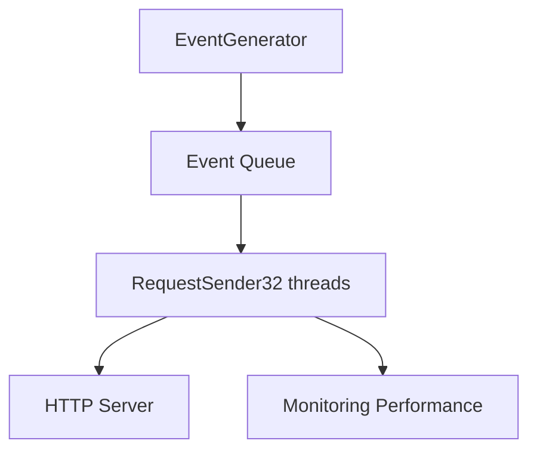
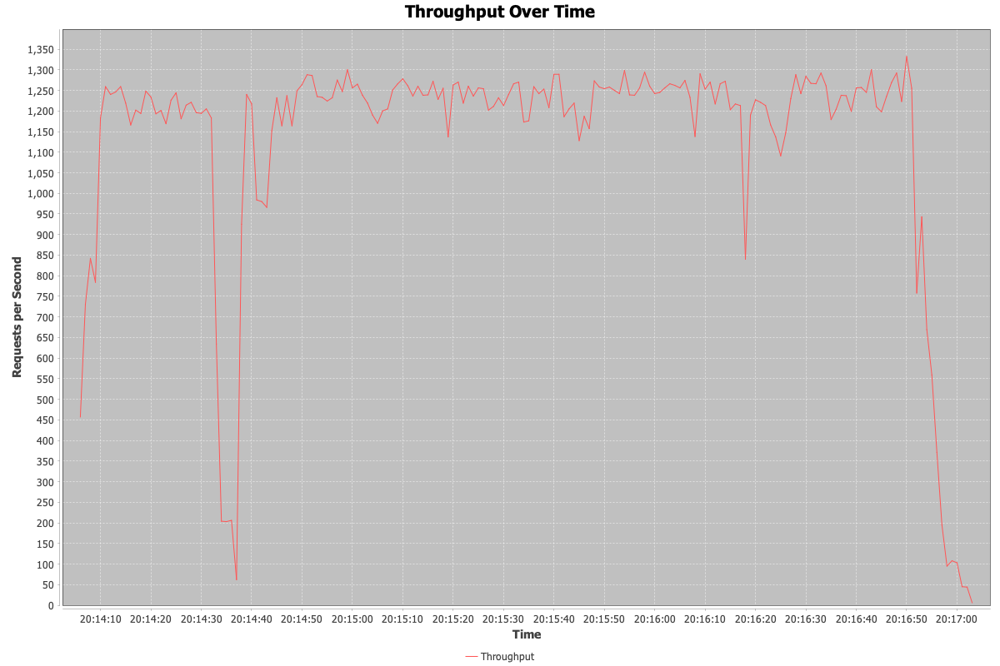
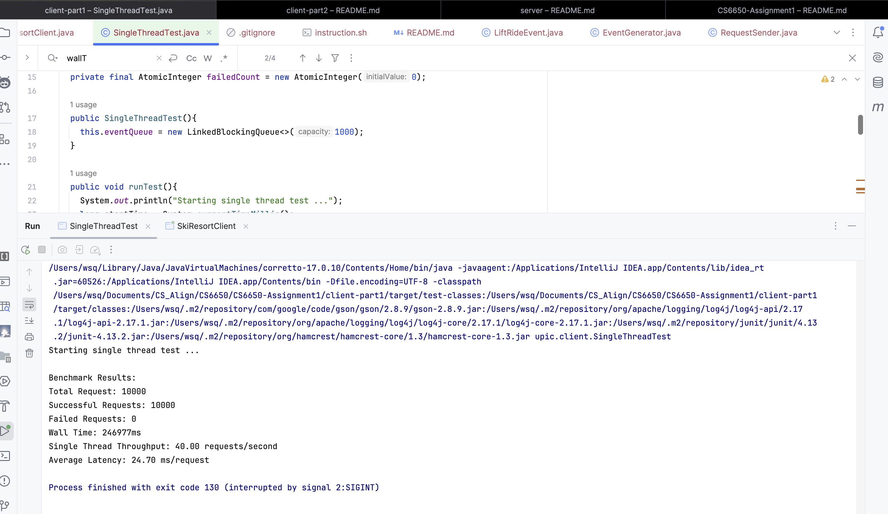
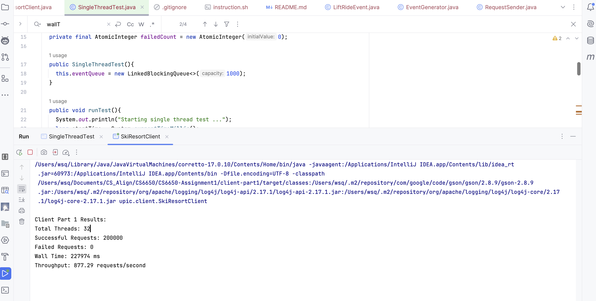
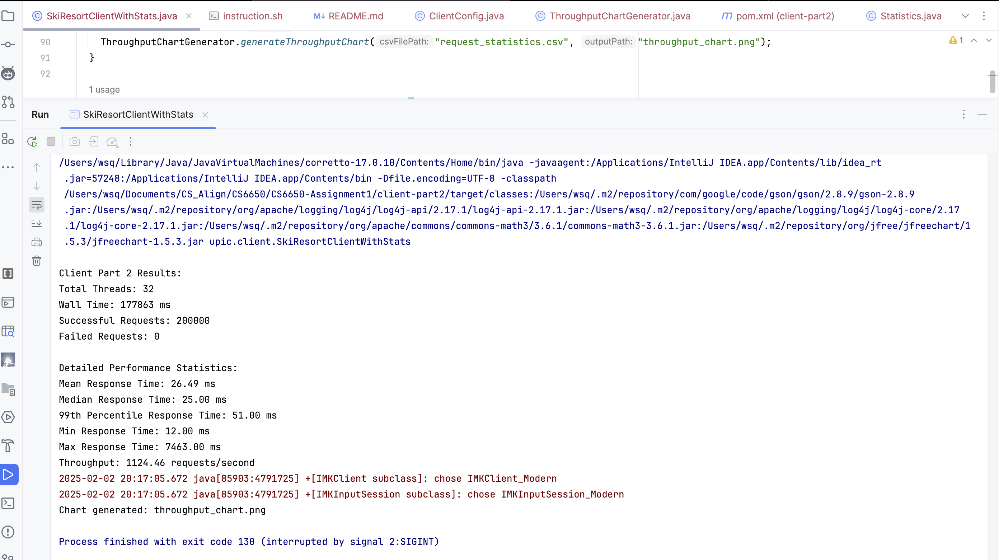
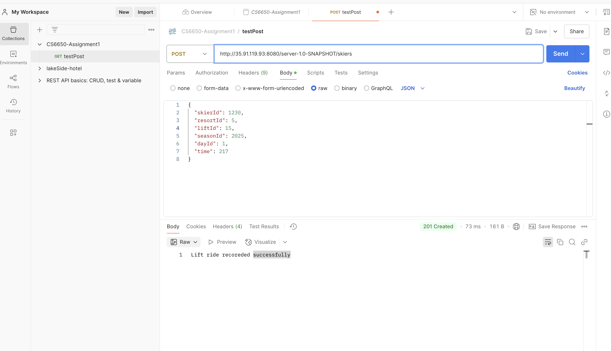

# CS6650-Assignment1

## System Review
This system implements a multi-threaded client for simulating and uploading ski lift ride events. The system efficiently sends large volumes of POST requests to the server while collecting detailed performance metrics.


## Architecture Design
### 1. Core Components
__EventGenerator__
* Runs in a dedicated thread
* Generates random lift ride events
* Implements producer-consumer pattern

__RequestSender__
* Manages multiple worker threads
* Handles HTTP request sending and retry logic
* Collects performance metrics

__Monitoring Performance__
* Records request start and end times
* Calculates statistics (mean, median, P99, etc.)
* Generates performance reports

### 2. Architecture Diagram


## Key Class Design
### 1. LiftRideEvent Class
```Java
public class LiftRideEvent {
    private int skierID;      // 1-100000
    private int resortID;     // 1-10
    private int liftID;       // 1-40
    private int seasonID;     // 2025
    private int dayID;        // 1
    private int time;         // 1-360
}
```

### 2. EventGenerator Class
```Java
public class EventGenerator implements Runnable {
    private BlockingQueue<LiftRideEvent> eventQueue;
    private final Random random = new Random();
    
    @Override
    public void run() {
        while (!Thread.interrupted()) {
            eventQueue.offer(generateEvent());
        }
    }
}
```

### 3. RequestSender Class
```Java
public class RequestSender implements Runnable {
    private final BlockingQueue<LiftRideEvent> eventQueue;
    private final PerformanceMonitor monitor;
    private final int requestCount;
    
    @Override
    public void run() {
        for (int i = 0; i < requestCount; i++) {
            LiftRideEvent event = eventQueue.take();
            sendWithRetry(event);
        }
    }
}
```

## Performance Analysis
### 1. Little's Law Calculation
According to Little's Law(N = X * R)
* N = 32(Threads number)
* R = 24,70ms(single request response time)
* Theoretical max throughput X = 32 * 0.0247 = 1295 requests/second

### 2. Actual performance
__Client1: Single Thread Test__
* Throughput: 40 requests/second
* Average latency: 24.70 ms


__Client 1: 32 Thread Test__
* Throughput: 1124.46 requests/second
* Average response time: 26.49 ms

__Client 2: 32 Thread Test With Statistics__
* Client Part 2 Results:
* Total Threads: 32
* Wall Time: 177863 ms
* Successful Requests: 200000
* Failed Requests: 0

Detailed Performance Statistics:
* Mean Response Time: 26.49 ms
* Median Response Time: 25.00 ms
* 99th Percentile Response Time: 51.00 ms
* Min Response Time: 12.00 ms
* Max Response Time: 7463.00 ms
* Throughput: 1124.46 requests/second

__Client 2: 32 Thread Test With Statistics using Spring Boot__
```markdown
| Metric | Servlet | Spring Boot |
|--------|---------|-------------|
| Mean Response Time | 26.49ms | ??ms |
| Throughput | 1124.46 req/s | ?? req/s |
| P99 Response Time | 51.00ms | ??ms |
| Min Response Time | 12.00ms | ??ms |
| Max Response Time | 7463ms | ??ms |

```

__Client 2: Throughput Over Time Plot__



### 3. Screenshot
__Single Thread Test__


__Client 1: 32 Thread Test__


__Client 2: 32 Thread Test With Statistics__


__Client 2: 32 Thread Test With Statistics using Spring Boot__

__EC2(Using Postman)__


