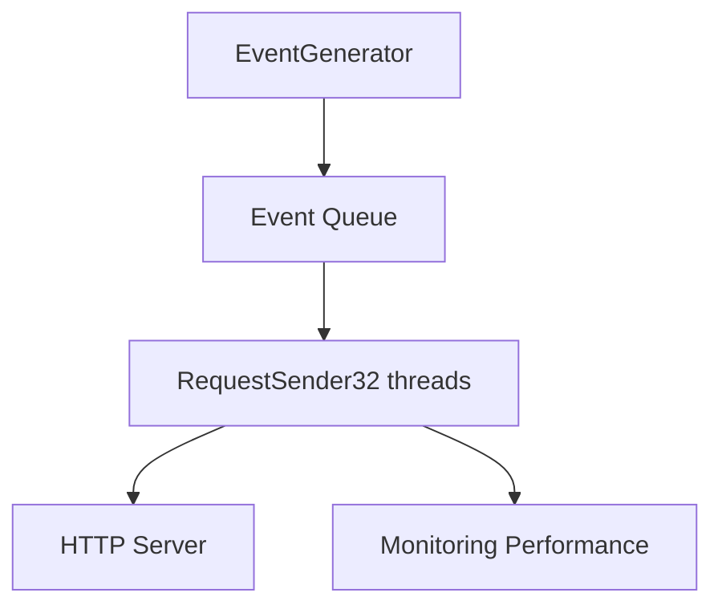
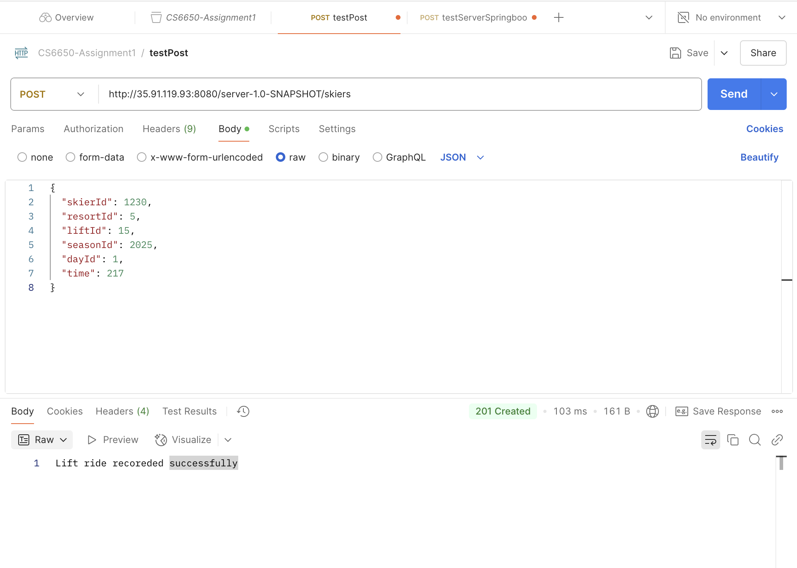
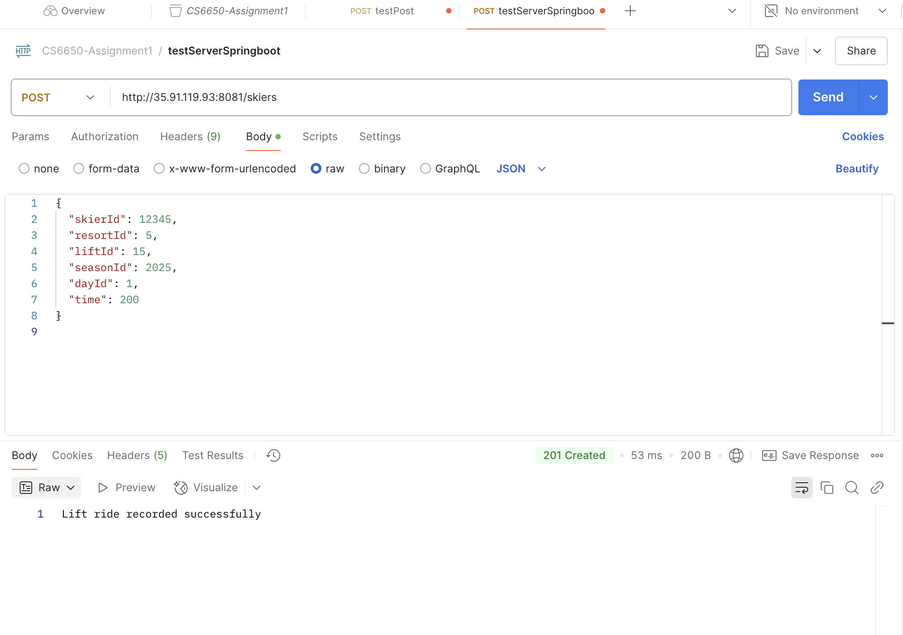
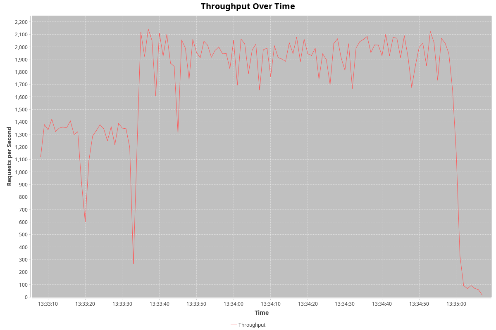
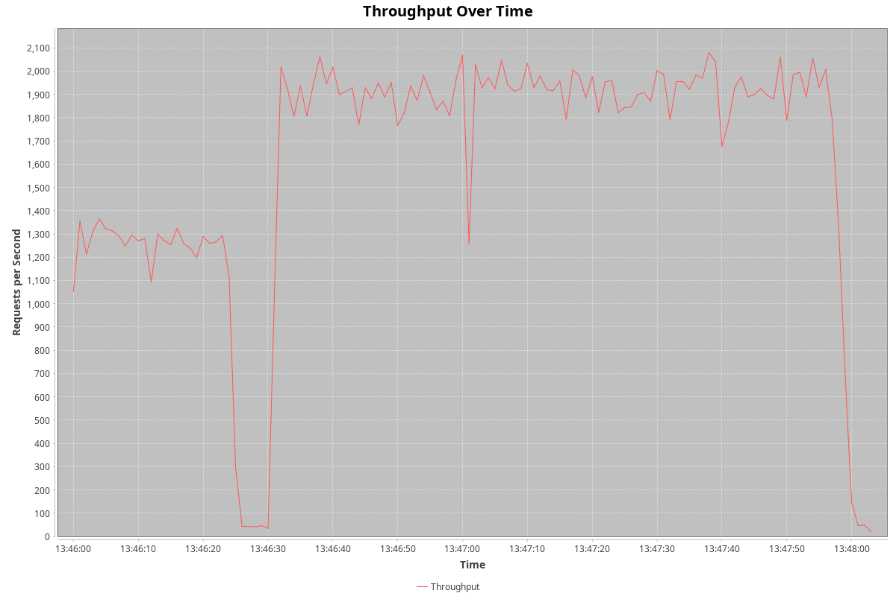
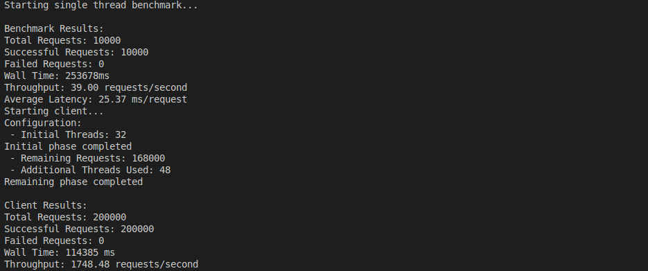
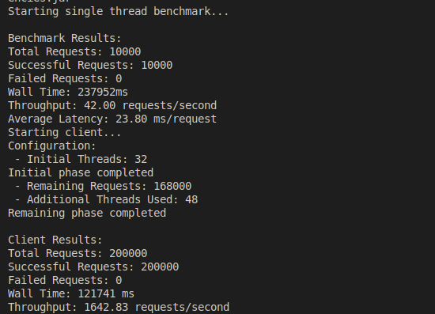
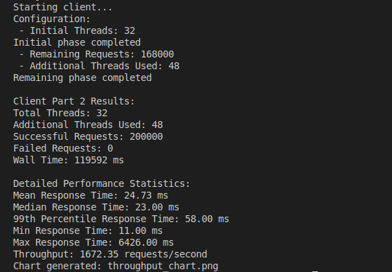
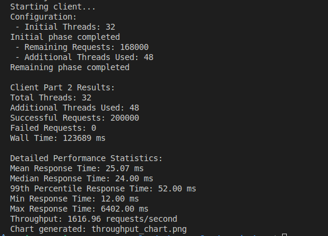

# CS6650-Assignment2

## System Review
This system implements a multi-threaded client for simulating and uploading ski lift ride events. The system efficiently sends large volumes of POST requests to the server while collecting detailed performance metrics.


## Architecture Design
### 1. Core Components
__EventGenerator__
* Runs in a dedicated thread
* Generates random lift ride events
* Implements producer-consumer pattern

__RequestSender__
* Manages multiple worker threads
* Handles HTTP request sending and retry logic
* Collects performance metrics

__Monitoring Performance__
* Records request start and end times
* Calculates statistics (mean, median, P99, etc.)
* Generates performance reports

### 2. Architecture Diagram


## Key Class Design
### 1. LiftRideEvent Class
```Java
public class LiftRideEvent {
    private int skierID;      // 1-100000
    private int resortID;     // 1-10
    private int liftID;       // 1-40
    private int seasonID;     // 2025
    private int dayID;        // 1
    private int time;         // 1-360
}
```

### 2. EventGenerator Class
```Java
public class EventGenerator implements Runnable {
    private BlockingQueue<LiftRideEvent> eventQueue;
    private final Random random = new Random();
    
    @Override
    public void run() {
        while (!Thread.interrupted()) {
            eventQueue.offer(generateEvent());
        }
    }
}
```

### 3. RequestSender Class
```Java
public class RequestSender implements Runnable {
    private final BlockingQueue<LiftRideEvent> eventQueue;
    private final PerformanceMonitor monitor;
    private final int requestCount;
    
    @Override
    public void run() {
        for (int i = 0; i < requestCount; i++) {
            LiftRideEvent event = eventQueue.take();
            sendWithRetry(event);
        }
    }
}
```

## Postman Test
__1. For Server-servlet__
http://35.91.119.93:8080/server-1.0-SNAPSHOT/skiers



__2. For Server-springboot__
http://35.91.119.93:8081/skiers



## Performance Analysis
### 1. Little's Law Calculation
__Single-thread baseline performance:__


* Average latency: 25.37ms/request
* Theoretical single-thread max throughput = 1/latency = 1/(0.02537 seconds) ≈ 39.42 requests/second


__For an 80-thread system:__
* Theoretical maximum throughput = single-thread throughput × number of threads
* Theoretical maximum throughput = 39.42 × 80 ≈ 3153.6 requests/second


__Observed throughput analysis:__
* Actual throughput: 1748.48 requests/second
* Throughput efficiency = (actual throughput/theoretical throughput) × 100%
* Efficiency = (1748.48/3153.6) × 100% ≈ 55.4%


### 2. Client1 Actual performance
__Performance Analysis using Servlet__
```txt
Starting single thread benchmark...

Benchmark Results:
Total Requests: 10000
Successful Requests: 10000
Failed Requests: 0
Wall Time: 253678ms
Throughput: 39.00 requests/second
Average Latency: 25.37 ms/request
Starting client...
Configuration:
 - Initial Threads: 32
Initial phase completed
 - Remaining Requests: 168000
 - Additional Threads Used: 48
Remaining phase completed

Client Results:
Total Requests: 200000
Successful Requests: 200000
Failed Requests: 0
Wall Time: 114385 ms
Throughput: 1748.48 requests/second
```


__Performance Analysis using Springboot__
```txt
Starting single thread benchmark...

Benchmark Results:
Total Requests: 10000
Successful Requests: 10000
Failed Requests: 0
Wall Time: 237952ms
Throughput: 42.00 requests/second
Average Latency: 23.80 ms/request
Starting client...
Configuration:
 - Initial Threads: 32
Initial phase completed
 - Remaining Requests: 168000
 - Additional Threads Used: 48
Remaining phase completed

Client Results:
Total Requests: 200000
Successful Requests: 200000
Failed Requests: 0
Wall Time: 121741 ms
Throughput: 1642.83 requests/second

```


### 3. Client2 Actual performance
__Performance Analysis using Servlet__
```txt
Starting client...
Configuration:
 - Initial Threads: 32
Initial phase completed
 - Remaining Requests: 168000
 - Additional Threads Used: 48
Remaining phase completed

Client Part 2 Results:
Total Threads: 32
Additional Threads Used: 48
Successful Requests: 200000
Failed Requests: 0
Wall Time: 119592 ms

Detailed Performance Statistics:
Mean Response Time: 24.73 ms
Median Response Time: 23.00 ms
99th Percentile Response Time: 58.00 ms
Min Response Time: 11.00 ms
Max Response Time: 6426.00 ms
Throughput: 1672.35 requests/second
Chart generated: throughput_chart.png
```
__Performance Analysis using Springboot__
```txt
Starting client...
Configuration:
 - Initial Threads: 32
Initial phase completed
 - Remaining Requests: 168000
 - Additional Threads Used: 48
Remaining phase completed

Client Part 2 Results:
Total Threads: 32
Additional Threads Used: 48
Successful Requests: 200000
Failed Requests: 0
Wall Time: 123689 ms

Detailed Performance Statistics:
Mean Response Time: 25.07 ms
Median Response Time: 24.00 ms
99th Percentile Response Time: 52.00 ms
Min Response Time: 12.00 ms
Max Response Time: 6402.00 ms
Throughput: 1616.96 requests/second
Chart generated: throughput_chart.png
```


__Client 2: Throughput Over Time Plot(Servlet)__


__Client 2: Throughput Over Time Plot(Springboot)__


## Screenshot

__Client 1: Using Servlet__


__Client 1: Using Springboot__



__Client 2: Using Servlet__


__Client 2: Using Springboot__



